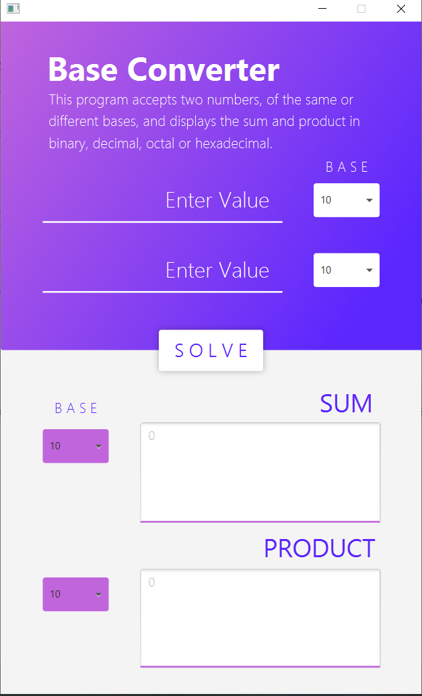

# Base-Converter-Calculator

As partial fulfillment to the course, Computer Architecture and Organization, the Base Converter/Calculator was created. This program can compute the sum and product of two numbers and converts them into different bases.

## Application Preview

